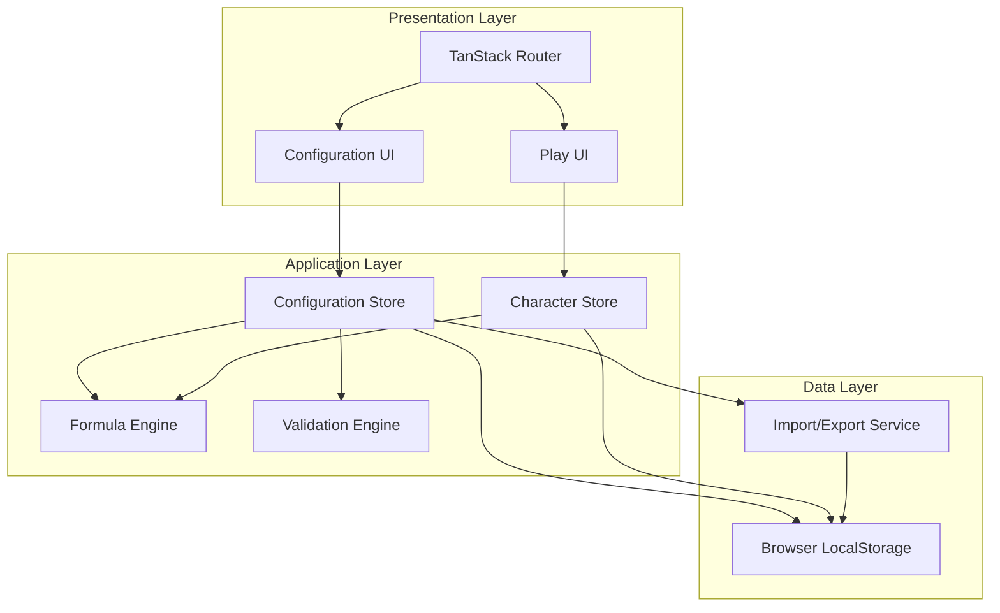

# Design Document: Custom DnD Builder

## Overview

The Custom DnD Builder is a browser-based React application that enables users to create fully customizable tabletop RPG experiences. The system operates in two distinct modes: Configuration Mode (for game designers) and Play Mode (for players). All data persists locally in browser storage with no external API dependencies.

### Key Design Principles

1. **Complete Customizability**: No hardcoded game data; users define all skills, stats, materials, items, and races
2. **Formula-Driven**: A robust formula engine calculates derived values dynamically
3. **Local-First**: All data stored in browser local storage with import/export capabilities
4. **Mode Separation**: Clear distinction between configuration and gameplay interfaces
5. **Real-Time Calculation**: Automatic recalculation of dependent values when base values change

### Technology Stack

- **Framework**: React 18+ with TypeScript
- **Build Tool**: Vite
- **Routing**: TanStack Router (file-based routing)
- **State Management**: Zustand (lightweight, performant state management)
- **Storage**: Browser LocalStorage API with JSON serialization
- **Formula Engine**: Custom parser with expression evaluation
- **Styling**: Tailwind CSS for utility-first styling with custom medieval theme
- **Component Architecture**: Centralized component library for base UI elements
- **Testing**: Vitest for unit tests, fast-check for property-based tests

## Architecture

### High-Level Architecture



### Application Structure

```
src/
├── routes/                    # TanStack Router file-based routes
│   ├── __root.tsx            # Root layout with mode switcher
│   ├── config/               # Configuration mode routes
│   │   ├── index.tsx         # Config dashboard
│   │   ├── skills.tsx        # Main/Speciality/Combat skills
│   │   ├── stats.tsx         # Stats configuration
│   │   ├── materials.tsx     # Materials and categories
│   │   ├── items.tsx         # Items and equipment slots
│   │   ├── races.tsx         # Race configuration
│   │   └── currency.tsx      # Currency tiers
│   └── play/                 # Play mode routes
│       ├── index.tsx         # Character list
│       ├── character.$id.tsx # Character sheet
│       └── create.tsx        # Character creation
├── stores/                   # Zustand state stores
│   ├── configStore.ts        # Configuration state
│   ├── characterStore.ts     # Character state
│   └── uiStore.ts           # UI state (mode, dialogs)
├── engine/                   # Core logic
│   ├── formula/             # Formula engine
│   │   ├── parser.ts        # Formula parsing
│   │   ├── evaluator.ts     # Expression evaluation
│   │   └── validator.ts     # Formula validation
│   ├── calculator.ts        # Stat/skill calculations
│   ├── dice.ts              # Dice rolling logic
│   └── validator.ts         # Configuration validation
├── services/                # External interactions
│   ├── storage.ts           # LocalStorage abstraction
│   └── importExport.ts      # JSON import/export
├── components/              # UI components
│   ├── ui/                 # Base component library
│   │   ├── Button.tsx      # Base button component
│   │   ├── Input.tsx       # Base input component
│   │   ├── Select.tsx      # Base select component
│   │   ├── Textarea.tsx    # Base textarea component
│   │   ├── Checkbox.tsx    # Base checkbox component
│   │   ├── Card.tsx        # Base card/panel component
│   │   ├── Label.tsx       # Base label component
│   │   ├── Dialog.tsx      # Base dialog/modal component
│   │   └── index.ts        # Component library exports
│   ├── config/             # Configuration feature components
│   ├── play/               # Play mode feature components
│   └── shared/             # Shared feature components
├── types/                   # TypeScript type definitions
│   ├── config.ts           # Configuration types
│   ├── character.ts        # Character types
│   └── formula.ts          # Formula types
├── styles/                  # Styling configuration
│   ├── theme.ts            # Medieval theme configuration
│   └── tailwind.config.ts  # Tailwind customization
└── utils/                   # Utility functions
    ├── validation.ts       # Validation helpers
    └── conversion.ts       # Currency conversion
```

### State Management Strategy

The application uses Zustand for state management with three primary stores:

1. **Configuration Store**: Manages all user-defined configuration data
   - Skills (Main, Speciality, Combat)
   - Stats definitions
   - Materials and categories
   - Items and equipment slots
   - Races
   - Currency tiers
   - Focus stat configuration

2. **Character Store**: Manages player character data
   - Character list
   - Character stats and skills
   - Inventory and equipment
   - Current stat values

3. **UI Store**: Manages application UI state
   - Current mode (config/play)
   - Dialog states
   - Validation results
   - Roll history

### Data Flow

1. **Configuration Changes**: User modifies config → ConfigStore updates → Validation runs → LocalStorage persists
2. **Character Updates**: Player modifies character → CharStore updates → Calculator recalculates → LocalStorage persists
3. **Equipment Changes**: Player equips item → CharStore updates → Calculator recalculates bonuses → UI updates
4. **Combat Rolls**: Player rolls skill → Dice engine generates results → Formula engine calculates bonus → UI displays breakdown

## Component Library Architecture

### Design Philosophy

The application maintains a strict separation between base UI components and feature components to ensure visual consistency, reusability, and maintainability. This architecture follows the principle of separation of concerns: base components handle intrinsic styling while feature components handle layout and composition.

### Base Components (src/components/ui/)

Base components are the foundational building blocks of the UI. They encapsulate all intrinsic styling properties but remain layout-agnostic.

#### Responsibilities of Base Components

**What Base Components Include:**
- Colors (background, text, border colors)
- Typography (font family, size, weight, line height)
- Padding and internal spacing
- Borders and border radius
- Visual states (hover, focus, active, disabled)
- Transitions and animations
- Box shadows and visual effects
- Intrinsic sizing (min-width, min-height)

**What Base Components Exclude:**
- Margin (external spacing)
- Flexbox/Grid properties (display, flex, grid, align-items, justify-content, etc.)
- Positioning (absolute, relative, fixed, sticky)
- Width/height constraints imposed by parent layout
- Z-index layering

#### Base Component Catalog

**Button Component**
```typescript
interface ButtonProps {
  variant?: 'primary' | 'secondary' | 'danger' | 'ghost';
  size?: 'sm' | 'md' | 'lg';
  disabled?: boolean;
  className?: string; // For positioning by parent
  children: React.ReactNode;
  onClick?: () => void;
}
```
Encapsulates: medieval button styling, hover/focus states, variant colors, padding, typography

**Input Component**
```typescript
interface InputProps {
  type?: 'text' | 'number' | 'email';
  value: string;
  onChange: (value: string) => void;
  placeholder?: string;
  disabled?: boolean;
  error?: boolean;
  className?: string;
}
```
Encapsulates: parchment-style input background, border styling, focus states, error states, padding, typography

**Select Component**
```typescript
interface SelectProps {
  value: string;
  onChange: (value: string) => void;
  options: Array<{ value: string; label: string }>;
  placeholder?: string;
  disabled?: boolean;
  className?: string;
}
```
Encapsulates: dropdown styling, option styling, focus states, medieval aesthetic

**Textarea Component**
```typescript
interface TextareaProps {
  value: string;
  onChange: (value: string) => void;
  placeholder?: string;
  rows?: number;
  disabled?: boolean;
  className?: string;
}
```
Encapsulates: multi-line input styling, resize behavior, scrollbar styling

**Checkbox Component**
```typescript
interface CheckboxProps {
  checked: boolean;
  onChange: (checked: boolean) => void;
  label?: string;
  disabled?: boolean;
  className?: string;
}
```
Encapsulates: custom checkbox styling, checked/unchecked states, label typography

**Card Component**
```typescript
interface CardProps {
  variant?: 'default' | 'elevated' | 'bordered';
  className?: string;
  children: React.ReactNode;
}
```
Encapsulates: parchment-style background, borders, shadows, padding, medieval aesthetic

**Label Component**
```typescript
interface LabelProps {
  htmlFor?: string;
  required?: boolean;
  className?: string;
  children: React.ReactNode;
}
```
Encapsulates: label typography, required indicator styling, color

**Dialog Component**
```typescript
interface DialogProps {
  open: boolean;
  onClose: () => void;
  title: string;
  className?: string;
  children: React.ReactNode;
}
```
Encapsulates: modal overlay, dialog box styling, close button, title styling, backdrop

### Feature Components (src/components/config/, src/components/play/, src/components/shared/)

Feature components compose base components to create application-specific functionality. They handle all layout, positioning, and business logic.

#### Responsibilities of Feature Components

**What Feature Components Handle:**
- Layout composition (flexbox, grid, positioning)
- Spacing between elements (margins, gaps)
- Responsive design breakpoints
- Component orchestration and data flow
- Business logic and state management
- Integration with stores and services

**Example: SkillsConfigPanel (Feature Component)**
```typescript
// Feature component handles layout and composition
function SkillsConfigPanel({ mode }: SkillsConfigPanelProps) {
  return (
    <div className="flex flex-col gap-4"> {/* Layout: flex, gap */}
      <Card className="mb-6"> {/* Positioning: margin-bottom */}
        <div className="flex justify-between items-center mb-4">
          <Label>Skills Configuration</Label>
          <Button 
            variant="primary" 
            className="ml-auto" // Positioning: margin-left
            onClick={handleAdd}
          >
            Add Skill
          </Button>
        </div>
        <div className="grid grid-cols-3 gap-4"> {/* Layout: grid */}
          {skills.map(skill => (
            <Input 
              key={skill.code}
              value={skill.name}
              onChange={handleChange}
              className="w-full" // Layout: width
            />
          ))}
        </div>
      </Card>
    </div>
  );
}
```

### Component Usage Guidelines

1. **Always use base components from the component library** - Never create custom styled inputs, buttons, etc. in feature components
2. **Use className prop for positioning** - Pass layout-related classes through className prop to base components
3. **Keep base components pure** - Base components should not import from stores or services
4. **Compose for complexity** - Build complex UIs by composing simple base components in feature components
5. **Maintain the separation** - If you need to add margin to a button, use className prop, don't modify the base Button component

### Medieval Theme Integration

Base components implement the medieval theme through:
- Custom Tailwind theme configuration
- Parchment-style backgrounds and textures
- Medieval-inspired color palette
- Serif and decorative fonts
- Subtle borders and shadows that evoke aged paper and ink

Feature components respect the theme by:
- Using only base components (which carry the theme)
- Avoiding modern layout patterns that break immersion
- Maintaining consistent spacing that feels deliberate and crafted

## Medieval Visual Theme

### Design Goals

The application employs a medieval-inspired aesthetic to create an immersive tabletop RPG experience. The theme balances atmospheric design with modern usability and accessibility requirements.

### Theme Principles

1. **Subtle Immersion**: Evoke medieval aesthetics without overwhelming the interface
2. **Readability First**: Never sacrifice legibility for aesthetic effect
3. **Accessibility Compliance**: Maintain WCAG standards for contrast, focus states, and interactive elements
4. **Avoid Modern Patterns**: Minimize flat design, neon colors, and contemporary sans-serif typography
5. **Texture and Depth**: Use subtle textures, shadows, and borders to create tactile feel

### Color Palette

**Primary Colors (Earthy Medieval Tones)**
```typescript
const colors = {
  // Parchment and paper tones
  parchment: {
    50: '#fdfbf7',   // Lightest parchment
    100: '#f8f4e8',  // Light parchment
    200: '#f0e8d0',  // Base parchment
    300: '#e8dbb8',  // Aged parchment
    400: '#d4c5a0',  // Dark parchment
  },
  
  // Ink and text colors
  ink: {
    900: '#2a2419',  // Deep ink black
    800: '#3d3529',  // Dark ink
    700: '#4f4739',  // Medium ink
    600: '#6b5d4f',  // Light ink
  },
  
  // Accent colors (medieval dyes)
  crimson: '#8b2e2e',    // Deep red (danger, delete)
  forest: '#3a5a40',     // Deep green (success, confirm)
  royal: '#2e4057',      // Deep blue (primary actions)
  amber: '#b8860b',      // Dark gold (highlights, focus)
  
  // Neutral tones
  stone: {
    100: '#e8e4df',
    200: '#d1cbc2',
    300: '#b9b2a5',
    400: '#9a9188',
  },
};
```

### Typography

**Font Families**
```typescript
const fonts = {
  // Primary text: Readable serif with medieval character
  body: '"Crimson Text", "Georgia", "Times New Roman", serif',
  
  // Headings: More decorative medieval style
  heading: '"Cinzel", "Trajan Pro", "Georgia", serif',
  
  // Code/formulas: Monospace for technical content
  mono: '"Courier New", "Courier", monospace',
};
```

**Type Scale**
- Headings: 1.5rem - 2.5rem (24px - 40px)
- Body: 1rem - 1.125rem (16px - 18px)
- Small text: 0.875rem (14px)
- Minimum size: 14px for accessibility

### Visual Elements

**Backgrounds**
- Primary background: Light parchment (#f8f4e8) with subtle paper texture
- Card backgrounds: Slightly lighter parchment (#fdfbf7) with soft shadow
- Input backgrounds: White with parchment-tinted border
- Modal overlays: Semi-transparent dark ink (#2a2419 at 60% opacity)

**Borders and Shadows**
```css
/* Subtle aged paper effect */
border: 1px solid rgba(42, 36, 25, 0.15);
box-shadow: 0 2px 4px rgba(42, 36, 25, 0.08);

/* Elevated cards (modals, popovers) */
box-shadow: 
  0 4px 6px rgba(42, 36, 25, 0.1),
  0 2px 4px rgba(42, 36, 25, 0.06);

/* Focus states (accessibility) */
outline: 2px solid #b8860b;
outline-offset: 2px;
```

**Textures**
- Subtle paper grain on parchment backgrounds (CSS noise or SVG pattern)
- Avoid heavy textures that interfere with text readability
- Use opacity: 0.03-0.05 for background textures

### Component-Specific Styling

**Buttons**
- Primary: Royal blue background with ink text, subtle shadow
- Secondary: Parchment background with ink border and text
- Danger: Crimson background with light text
- Hover: Slight darkening + shadow increase
- Active: Pressed effect with reduced shadow

**Inputs and Textareas**
- White background with parchment-tinted border
- Focus: Amber outline (accessibility)
- Error: Crimson border
- Placeholder: Light ink color (#6b5d4f)

**Cards and Panels**
- Light parchment background
- Subtle border in dark ink
- Soft shadow for depth
- Rounded corners (4px-8px, not too modern)

**Dialogs and Modals**
- Elevated card styling with stronger shadow
- Dark overlay behind modal
- Close button in top-right with clear focus state

**Tables and Lists**
- Alternating row backgrounds (parchment 50 and 100)
- Borders in light ink
- Hover state: Slight amber tint

### Accessibility Considerations

**Contrast Ratios**
- Body text on parchment: Minimum 7:1 (AAA standard)
- Interactive elements: Minimum 4.5:1 (AA standard)
- Focus indicators: High contrast amber (#b8860b) on all backgrounds

**Focus States**
- Visible 2px outline on all interactive elements
- Outline offset for clarity
- Never remove focus indicators

**Interactive Sizing**
- Minimum touch target: 44x44px
- Button padding ensures adequate size
- Sufficient spacing between interactive elements

**Motion and Animation**
- Respect prefers-reduced-motion
- Subtle transitions (200-300ms)
- No auto-playing animations

### Responsive Design

The medieval theme adapts to different screen sizes while maintaining aesthetic:
- Mobile: Simplified textures, larger touch targets
- Tablet: Full theme with adjusted spacing
- Desktop: Complete theme with all visual details

### Implementation Strategy

**Tailwind Configuration**
Extend Tailwind's default theme with medieval color palette and fonts:
```typescript
// tailwind.config.ts
export default {
  theme: {
    extend: {
      colors: { /* medieval palette */ },
      fontFamily: { /* medieval fonts */ },
      boxShadow: { /* custom shadows */ },
    },
  },
};
```

**CSS Custom Properties**
Define theme variables for runtime flexibility:
```css
:root {
  --color-parchment: #f8f4e8;
  --color-ink: #2a2419;
  --color-royal: #2e4057;
  --color-amber: #b8860b;
  /* ... */
}
```

**Component Library Integration**
All base components use theme tokens exclusively, ensuring consistent application of the medieval aesthetic throughout the application.

## Components and Interfaces

This section describes the feature components that compose the application's functionality. All feature components use base components from the component library (src/components/ui/) for UI elements and handle layout, positioning, and business logic.

### Base Component Usage Pattern

Feature components follow this pattern:
1. Import base components from the component library
2. Compose base components with layout classes (flex, grid, margin, etc.)
3. Handle business logic and state management
4. Pass positioning classes via className prop to base components

Example:
```typescript
import { Button, Input, Card } from '@/components/ui';

function MyFeature() {
  return (
    <Card className="mb-4"> {/* Feature component adds margin */}
      <div className="flex gap-2"> {/* Feature component handles layout */}
        <Input className="flex-1" /> {/* Positioning via className */}
        <Button variant="primary">Save</Button>
      </div>
    </Card>
  );
}
```

### Configuration Mode Components

#### SkillsConfigPanel
Manages Main_Skills, Speciality_Skills, and Combat_Skills configuration.

```typescript
interface SkillsConfigPanelProps {
  mode: 'main' | 'speciality' | 'combat';
}

// Feature component that composes base components
// Uses Card, Button, Input, Label from component library
// Handles layout with flexbox and grid
// Manages skill list state and validation
// Displays skill list with add/edit/delete actions
// Validates 3-letter codes for uniqueness
// Shows dependency warnings before deletion
```

#### StatsConfigPanel
Manages Stat definitions with formula editor.

```typescript
interface StatsConfigPanelProps {
  availableSkills: string[]; // For formula autocomplete
}

// Feature component using FormulaEditor (shared component)
// Uses Card, Button, Input, Label from component library
// Formula editor with syntax highlighting
// Real-time formula validation
// Preview calculated values with sample inputs
```

#### MaterialsConfigPanel
Manages Materials, Material_Levels, and Material_Categories.

```typescript
interface MaterialsConfigPanelProps {
  categories: MaterialCategory[];
}

// Nested UI: Categories → Materials → Levels
// Bonus/penalty editor for each level
// Value editor with currency tier selection
```

#### ItemsConfigPanel
Manages Items and Equipment_Slot definitions.

```typescript
interface ItemsConfigPanelProps {
  materials: Material[];
  equipmentSlots: EquipmentSlot[];
}

// Item list with filtering by category
// Material assignment dropdown
// Equipment slot type selector
```

#### RacesConfigPanel
Manages Race definitions with skill modifiers.

```typescript
interface RacesConfigPanelProps {
  mainSkills: MainSkill[];
}

// Race list with add/edit/delete
// Skill modifier editor (bonus/penalty)
// Preview total modifiers
```

#### CurrencyConfigPanel
Manages Currency_Tiers and conversion rates.

```typescript
interface CurrencyConfigPanelProps {
  tiers: CurrencyTier[];
}

// Ordered tier list (drag to reorder)
// Conversion rate editor
// Conversion calculator preview
```

### Play Mode Components

#### CharacterList
Displays all created characters with create/delete actions.

```typescript
interface CharacterListProps {
  characters: Character[];
  onSelect: (id: string) => void;
  onCreate: () => void;
  onDelete: (id: string) => void;
}
```

#### CharacterCreationWizard
Multi-step character creation flow.

```typescript
interface CharacterCreationWizardProps {
  config: Configuration;
}

// Steps:
// 1. Name and race selection
// 2. Main skill point allocation
// 3. Focus stat selection
// 4. Review and confirm
```

#### CharacterSheet
Main character display with all stats, skills, and inventory.

```typescript
interface CharacterSheetProps {
  characterId: string;
}

// Sections:
// - Header (name, races)
// - Main Skills (with racial bonuses)
// - Stats (current/max with edit controls)
// - Speciality Skills (calculated)
// - Combat Skills (with roll buttons)
// - Inventory (equipment slots + misc)
```

#### InventoryPanel
Equipment and item management interface.

```typescript
interface InventoryPanelProps {
  character: Character;
  availableItems: Item[];
}

// Equipment slots grid
// Miscellaneous items list
// Drag-and-drop item assignment
// Add item from catalog
// Remove item action
```

#### CombatSkillRoller
Dice rolling interface with result breakdown.

```typescript
interface CombatSkillRollerProps {
  skill: CombatSkill;
  character: Character;
}

// Roll button
// Animated dice display
// Result breakdown:
//   - Individual die results
//   - Bonus calculation
//   - Total
// Roll history
```

### Shared Components

Shared components are feature components used across both configuration and play modes.

#### FormulaEditor
Reusable formula input with validation (feature component).

```typescript
interface FormulaEditorProps {
  value: string;
  onChange: (value: string) => void;
  availableVariables: string[];
  onValidate: (isValid: boolean, error?: string) => void;
}

// Feature component using Input, Label from component library
// Syntax highlighting
// Autocomplete for skill codes
// Real-time validation feedback
// Error message display
```

#### ValidationReport
Displays configuration validation results (feature component).

```typescript
interface ValidationReportProps {
  issues: ValidationIssue[];
}

// Feature component using Card, Button from component library
// Grouped by severity (error/warning)
// Clickable to navigate to problem area
// Summary count
```

## Data Models

### Configuration Types

```typescript
interface Configuration {
  id: string;
  name: string;
  version: string;
  mainSkills: MainSkill[];
  stats: Stat[];
  specialitySkills: SpecialitySkill[];
  combatSkills: CombatSkill[];
  materials: Material[];
  materialCategories: MaterialCategory[];
  items: Item[];
  equipmentSlots: EquipmentSlot[];
  races: Race[];
  currencyTiers: CurrencyTier[];
  focusStatBonusLevel: number;
  createdAt: string;
  updatedAt: string;
}

interface MainSkill {
  code: string; // 3-letter unique identifier
  name: string;
  description: string;
  maxLevel: number;
}

interface Stat {
  id: string;
  name: string;
  description: string;
  formula: string; // e.g., "STR * 10 + CON * 5"
}

interface SpecialitySkill {
  code: string; // 3-letter unique identifier
  name: string;
  description: string;
  maxBaseLevel: number;
  bonusFormula: string; // e.g., "(STR + DEX) / 2"
}

interface CombatSkill {
  code: string; // 3-letter unique identifier
  name: string;
  description: string;
  dice: DiceConfig;
  bonusFormula: string; // e.g., "STR + MEL"
}

interface DiceConfig {
  d4: number;
  d6: number;
  d8: number;
  d10: number;
  d12: number;
  d20: number;
}

interface Material {
  id: string;
  name: string;
  description: string;
  categoryId: string;
  levels: MaterialLevel[];
}

interface MaterialLevel {
  level: number;
  name: string; // e.g., "Iron", "Steel", "Mithril"
  bonuses: SkillModifier[];
  value: CurrencyValue;
}

interface SkillModifier {
  skillCode: string; // References Main/Speciality/Combat skill
  modifier: number; // Positive for bonus, negative for penalty
}

interface CurrencyValue {
  tierId: string;
  amount: number;
}

interface MaterialCategory {
  id: string;
  name: string;
  description: string;
}

interface Item {
  id: string;
  name: string;
  description: string;
  categoryId?: string;
  materialId?: string;
  materialLevel?: number;
  equipmentSlotType?: string;
}

interface EquipmentSlot {
  type: string; // e.g., "helmet", "main_hand"
  name: string;
  description: string;
}

interface Race {
  id: string;
  name: string;
  description: string;
  skillModifiers: SkillModifier[]; // Only Main_Skills
}

interface CurrencyTier {
  id: string;
  name: string;
  order: number; // 0 = lowest value
  conversionToNext: number; // How many of this tier = 1 of next tier
}
```

### Character Types

```typescript
interface Character {
  id: string;
  name: string;
  configurationId: string;
  raceIds: string[];
  mainSkillLevels: Record<string, number>; // skillCode -> level
  focusStatCode?: string; // Main or Speciality skill code
  specialitySkillBaseLevels: Record<string, number>; // skillCode -> base level
  currentStatValues: Record<string, number>; // statId -> current value
  inventory: Inventory;
  createdAt: string;
  updatedAt: string;
}

interface Inventory {
  equippedItems: Record<string, string>; // equipmentSlotType -> itemId
  miscItems: string[]; // Array of itemIds
}

// Calculated values (not persisted, computed on demand)
interface CalculatedCharacter extends Character {
  totalMainSkillLevels: Record<string, number>; // With racial bonuses
  maxStatValues: Record<string, number>; // Calculated from formulas
  specialitySkillTotalLevels: Record<string, number>; // Base + bonus
  combatSkillBonuses: Record<string, number>; // Calculated from formulas
  equipmentBonuses: SkillModifier[]; // From equipped items
}
```

### Formula Types

```typescript
interface FormulaAST {
  type: 'number' | 'variable' | 'binary_op' | 'unary_op';
  value?: number | string;
  operator?: '+' | '-' | '*' | '/' | 'negate';
  left?: FormulaAST;
  right?: FormulaAST;
  operand?: FormulaAST;
}

interface FormulaContext {
  variables: Record<string, number>; // skillCode -> value
}

interface FormulaValidationResult {
  isValid: boolean;
  errors: string[];
  referencedVariables: string[];
}
```

### Storage Schema

LocalStorage keys:
- `dnd_builder_config`: Serialized Configuration object
- `dnd_builder_characters`: Array of serialized Character objects
- `dnd_builder_ui_state`: UI preferences and state

## Styling and Theme Implementation

### Tailwind Configuration

The application extends Tailwind CSS with a custom medieval theme configuration:

```typescript
// tailwind.config.ts
import type { Config } from 'tailwindcss';

export default {
  content: ['./index.html', './src/**/*.{js,ts,jsx,tsx}'],
  theme: {
    extend: {
      colors: {
        parchment: {
          50: '#fdfbf7',
          100: '#f8f4e8',
          200: '#f0e8d0',
          300: '#e8dbb8',
          400: '#d4c5a0',
        },
        ink: {
          900: '#2a2419',
          800: '#3d3529',
          700: '#4f4739',
          600: '#6b5d4f',
        },
        crimson: '#8b2e2e',
        forest: '#3a5a40',
        royal: '#2e4057',
        amber: '#b8860b',
        stone: {
          100: '#e8e4df',
          200: '#d1cbc2',
          300: '#b9b2a5',
          400: '#9a9188',
        },
      },
      fontFamily: {
        body: ['"Crimson Text"', 'Georgia', '"Times New Roman"', 'serif'],
        heading: ['"Cinzel"', '"Trajan Pro"', 'Georgia', 'serif'],
        mono: ['"Courier New"', 'Courier', 'monospace'],
      },
      boxShadow: {
        'parchment': '0 2px 4px rgba(42, 36, 25, 0.08)',
        'parchment-lg': '0 4px 6px rgba(42, 36, 25, 0.1), 0 2px 4px rgba(42, 36, 25, 0.06)',
      },
    },
  },
  plugins: [],
} satisfies Config;
```

### CSS Custom Properties

Global CSS variables for theme consistency:

```css
/* src/styles/globals.css */
:root {
  /* Colors */
  --color-parchment: #f8f4e8;
  --color-ink: #2a2419;
  --color-royal: #2e4057;
  --color-amber: #b8860b;
  --color-crimson: #8b2e2e;
  --color-forest: #3a5a40;
  
  /* Typography */
  --font-body: "Crimson Text", Georgia, "Times New Roman", serif;
  --font-heading: "Cinzel", "Trajan Pro", Georgia, serif;
  --font-mono: "Courier New", Courier, monospace;
  
  /* Spacing */
  --spacing-xs: 0.25rem;
  --spacing-sm: 0.5rem;
  --spacing-md: 1rem;
  --spacing-lg: 1.5rem;
  --spacing-xl: 2rem;
  
  /* Borders */
  --border-radius: 0.375rem;
  --border-color: rgba(42, 36, 25, 0.15);
}

body {
  font-family: var(--font-body);
  background-color: var(--color-parchment);
  color: var(--color-ink);
}

/* Subtle paper texture */
body::before {
  content: '';
  position: fixed;
  top: 0;
  left: 0;
  width: 100%;
  height: 100%;
  opacity: 0.03;
  background-image: url("data:image/svg+xml,%3Csvg xmlns='http://www.w3.org/2000/svg' width='100' height='100'%3E%3Cfilter id='noise'%3E%3CfeTurbulence type='fractalNoise' baseFrequency='0.9' numOctaves='4' /%3E%3C/filter%3E%3Crect width='100' height='100' filter='url(%23noise)' /%3E%3C/svg%3E");
  pointer-events: none;
  z-index: -1;
}
```

### Component Library Styling Guidelines

Each base component in the component library follows these styling principles:

1. **Use Tailwind classes for all styling** - Avoid inline styles
2. **Reference theme colors** - Use `bg-parchment-100`, `text-ink-900`, etc.
3. **Include all visual states** - hover, focus, active, disabled
4. **Ensure accessibility** - Proper focus indicators, contrast ratios
5. **Accept className prop** - Allow parent components to add positioning
6. **Use CSS variables for consistency** - Reference custom properties when needed

Example base component styling:
```typescript
// src/components/ui/Button.tsx
export function Button({ variant = 'primary', className, ...props }: ButtonProps) {
  const baseStyles = 'px-4 py-2 rounded font-heading transition-all duration-200 focus:outline-none focus:ring-2 focus:ring-amber focus:ring-offset-2';
  
  const variantStyles = {
    primary: 'bg-royal text-parchment-50 hover:bg-royal/90 shadow-parchment',
    secondary: 'bg-parchment-100 text-ink-900 border border-ink-900/20 hover:bg-parchment-200',
    danger: 'bg-crimson text-parchment-50 hover:bg-crimson/90',
  };
  
  return (
    <button 
      className={cn(baseStyles, variantStyles[variant], className)}
      {...props}
    />
  );
}
```

