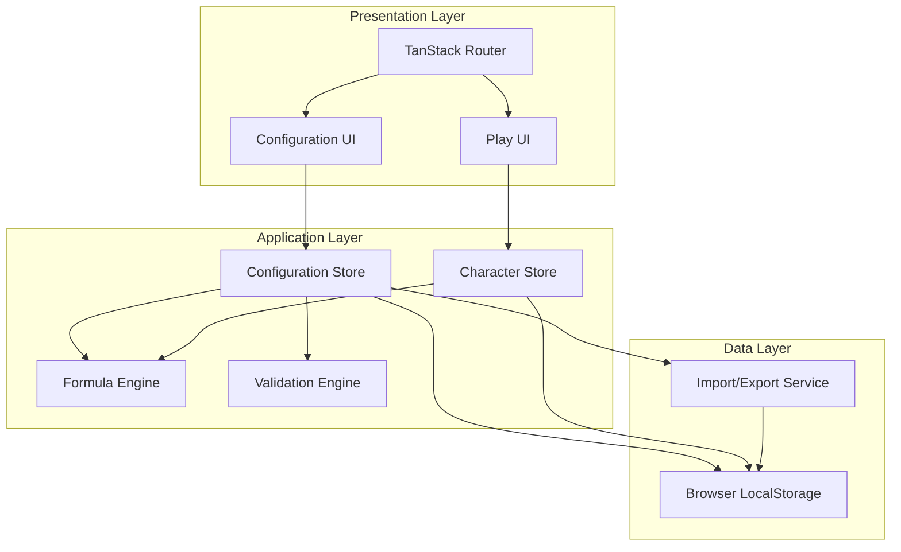

# Design Document: Custom DnD Builder

## Overview

The Custom DnD Builder is a browser-based React application that enables users to create fully customizable tabletop RPG experiences. The system operates in two distinct modes: Configuration Mode (for game designers) and Play Mode (for players). All data persists locally in browser storage with no external API dependencies.

### Key Design Principles

1. **Complete Customizability**: No hardcoded game data; users define all skills, stats, materials, items, and races
2. **Formula-Driven**: A robust formula engine calculates derived values dynamically
3. **Local-First**: All data stored in browser local storage with import/export capabilities
4. **Mode Separation**: Clear distinction between configuration and gameplay interfaces
5. **Real-Time Calculation**: Automatic recalculation of dependent values when base values change

### Technology Stack

- **Framework**: React 18+ with TypeScript
- **Build Tool**: Vite
- **Routing**: TanStack Router (file-based routing)
- **State Management**: Zustand (lightweight, performant state management)
- **Storage**: Browser LocalStorage API with JSON serialization
- **Formula Engine**: Custom parser with expression evaluation
- **Styling**: Tailwind CSS for utility-first styling
- **Testing**: Vitest for unit tests, fast-check for property-based tests

## Architecture

### High-Level Architecture



### Application Structure

```
src/
├── routes/                    # TanStack Router file-based routes
│   ├── __root.tsx            # Root layout with mode switcher
│   ├── config/               # Configuration mode routes
│   │   ├── index.tsx         # Config dashboard
│   │   ├── skills.tsx        # Main/Speciality/Combat skills
│   │   ├── stats.tsx         # Stats configuration
│   │   ├── materials.tsx     # Materials and categories
│   │   ├── items.tsx         # Items and equipment slots
│   │   ├── races.tsx         # Race configuration
│   │   └── currency.tsx      # Currency tiers
│   └── play/                 # Play mode routes
│       ├── index.tsx         # Character list
│       ├── character.$id.tsx # Character sheet
│       └── create.tsx        # Character creation
├── stores/                   # Zustand state stores
│   ├── configStore.ts        # Configuration state
│   ├── characterStore.ts     # Character state
│   └── uiStore.ts           # UI state (mode, dialogs)
├── engine/                   # Core logic
│   ├── formula/             # Formula engine
│   │   ├── parser.ts        # Formula parsing
│   │   ├── evaluator.ts     # Expression evaluation
│   │   └── validator.ts     # Formula validation
│   ├── calculator.ts        # Stat/skill calculations
│   ├── dice.ts              # Dice rolling logic
│   └── validator.ts         # Configuration validation
├── services/                # External interactions
│   ├── storage.ts           # LocalStorage abstraction
│   └── importExport.ts      # JSON import/export
├── components/              # Reusable UI components
│   ├── config/             # Configuration components
│   ├── play/               # Play mode components
│   └── shared/             # Shared components
├── types/                   # TypeScript type definitions
│   ├── config.ts           # Configuration types
│   ├── character.ts        # Character types
│   └── formula.ts          # Formula types
└── utils/                   # Utility functions
    ├── validation.ts       # Validation helpers
    └── conversion.ts       # Currency conversion
```

### State Management Strategy

The application uses Zustand for state management with three primary stores:

1. **Configuration Store**: Manages all user-defined configuration data
   - Skills (Main, Speciality, Combat)
   - Stats definitions
   - Materials and categories
   - Items and equipment slots
   - Races
   - Currency tiers
   - Focus stat configuration

2. **Character Store**: Manages player character data
   - Character list
   - Character stats and skills
   - Inventory and equipment
   - Current stat values

3. **UI Store**: Manages application UI state
   - Current mode (config/play)
   - Dialog states
   - Validation results
   - Roll history

### Data Flow

1. **Configuration Changes**: User modifies config → ConfigStore updates → Validation runs → LocalStorage persists
2. **Character Updates**: Player modifies character → CharStore updates → Calculator recalculates → LocalStorage persists
3. **Equipment Changes**: Player equips item → CharStore updates → Calculator recalculates bonuses → UI updates
4. **Combat Rolls**: Player rolls skill → Dice engine generates results → Formula engine calculates bonus → UI displays breakdown

## Components and Interfaces

### Configuration Mode Components

#### SkillsConfigPanel
Manages Main_Skills, Speciality_Skills, and Combat_Skills configuration.

```typescript
interface SkillsConfigPanelProps {
  mode: 'main' | 'speciality' | 'combat';
}

// Displays skill list with add/edit/delete actions
// Validates 3-letter codes for uniqueness
// Shows dependency warnings before deletion
```

#### StatsConfigPanel
Manages Stat definitions with formula editor.

```typescript
interface StatsConfigPanelProps {
  availableSkills: string[]; // For formula autocomplete
}

// Formula editor with syntax highlighting
// Real-time formula validation
// Preview calculated values with sample inputs
```

#### MaterialsConfigPanel
Manages Materials, Material_Levels, and Material_Categories.

```typescript
interface MaterialsConfigPanelProps {
  categories: MaterialCategory[];
}

// Nested UI: Categories → Materials → Levels
// Bonus/penalty editor for each level
// Value editor with currency tier selection
```

#### ItemsConfigPanel
Manages Items and Equipment_Slot definitions.

```typescript
interface ItemsConfigPanelProps {
  materials: Material[];
  equipmentSlots: EquipmentSlot[];
}

// Item list with filtering by category
// Material assignment dropdown
// Equipment slot type selector
```

#### RacesConfigPanel
Manages Race definitions with skill modifiers.

```typescript
interface RacesConfigPanelProps {
  mainSkills: MainSkill[];
}

// Race list with add/edit/delete
// Skill modifier editor (bonus/penalty)
// Preview total modifiers
```

#### CurrencyConfigPanel
Manages Currency_Tiers and conversion rates.

```typescript
interface CurrencyConfigPanelProps {
  tiers: CurrencyTier[];
}

// Ordered tier list (drag to reorder)
// Conversion rate editor
// Conversion calculator preview
```

### Play Mode Components

#### CharacterList
Displays all created characters with create/delete actions.

```typescript
interface CharacterListProps {
  characters: Character[];
  onSelect: (id: string) => void;
  onCreate: () => void;
  onDelete: (id: string) => void;
}
```

#### CharacterCreationWizard
Multi-step character creation flow.

```typescript
interface CharacterCreationWizardProps {
  config: Configuration;
}

// Steps:
// 1. Name and race selection
// 2. Main skill point allocation
// 3. Focus stat selection
// 4. Review and confirm
```

#### CharacterSheet
Main character display with all stats, skills, and inventory.

```typescript
interface CharacterSheetProps {
  characterId: string;
}

// Sections:
// - Header (name, races)
// - Main Skills (with racial bonuses)
// - Stats (current/max with edit controls)
// - Speciality Skills (calculated)
// - Combat Skills (with roll buttons)
// - Inventory (equipment slots + misc)
```

#### InventoryPanel
Equipment and item management interface.

```typescript
interface InventoryPanelProps {
  character: Character;
  availableItems: Item[];
}

// Equipment slots grid
// Miscellaneous items list
// Drag-and-drop item assignment
// Add item from catalog
// Remove item action
```

#### CombatSkillRoller
Dice rolling interface with result breakdown.

```typescript
interface CombatSkillRollerProps {
  skill: CombatSkill;
  character: Character;
}

// Roll button
// Animated dice display
// Result breakdown:
//   - Individual die results
//   - Bonus calculation
//   - Total
// Roll history
```

### Shared Components

#### FormulaEditor
Reusable formula input with validation.

```typescript
interface FormulaEditorProps {
  value: string;
  onChange: (value: string) => void;
  availableVariables: string[];
  onValidate: (isValid: boolean, error?: string) => void;
}

// Syntax highlighting
// Autocomplete for skill codes
// Real-time validation feedback
// Error message display
```

#### ValidationReport
Displays configuration validation results.

```typescript
interface ValidationReportProps {
  issues: ValidationIssue[];
}

// Grouped by severity (error/warning)
// Clickable to navigate to problem area
// Summary count
```

## Data Models

### Configuration Types

```typescript
interface Configuration {
  id: string;
  name: string;
  version: string;
  mainSkills: MainSkill[];
  stats: Stat[];
  specialitySkills: SpecialitySkill[];
  combatSkills: CombatSkill[];
  materials: Material[];
  materialCategories: MaterialCategory[];
  items: Item[];
  equipmentSlots: EquipmentSlot[];
  races: Race[];
  currencyTiers: CurrencyTier[];
  focusStatBonusLevel: number;
  createdAt: string;
  updatedAt: string;
}

interface MainSkill {
  code: string; // 3-letter unique identifier
  name: string;
  description: string;
  maxLevel: number;
}

interface Stat {
  id: string;
  name: string;
  description: string;
  formula: string; // e.g., "STR * 10 + CON * 5"
}

interface SpecialitySkill {
  code: string; // 3-letter unique identifier
  name: string;
  description: string;
  maxBaseLevel: number;
  bonusFormula: string; // e.g., "(STR + DEX) / 2"
}

interface CombatSkill {
  code: string; // 3-letter unique identifier
  name: string;
  description: string;
  dice: DiceConfig;
  bonusFormula: string; // e.g., "STR + MEL"
}

interface DiceConfig {
  d4: number;
  d6: number;
  d8: number;
  d10: number;
  d12: number;
  d20: number;
}

interface Material {
  id: string;
  name: string;
  description: string;
  categoryId: string;
  levels: MaterialLevel[];
}

interface MaterialLevel {
  level: number;
  name: string; // e.g., "Iron", "Steel", "Mithril"
  bonuses: SkillModifier[];
  value: CurrencyValue;
}

interface SkillModifier {
  skillCode: string; // References Main/Speciality/Combat skill
  modifier: number; // Positive for bonus, negative for penalty
}

interface CurrencyValue {
  tierId: string;
  amount: number;
}

interface MaterialCategory {
  id: string;
  name: string;
  description: string;
}

interface Item {
  id: string;
  name: string;
  description: string;
  categoryId?: string;
  materialId?: string;
  materialLevel?: number;
  equipmentSlotType?: string;
}

interface EquipmentSlot {
  type: string; // e.g., "helmet", "main_hand"
  name: string;
  description: string;
}

interface Race {
  id: string;
  name: string;
  description: string;
  skillModifiers: SkillModifier[]; // Only Main_Skills
}

interface CurrencyTier {
  id: string;
  name: string;
  order: number; // 0 = lowest value
  conversionToNext: number; // How many of this tier = 1 of next tier
}
```

### Character Types

```typescript
interface Character {
  id: string;
  name: string;
  configurationId: string;
  raceIds: string[];
  mainSkillLevels: Record<string, number>; // skillCode -> level
  focusStatCode?: string; // Main or Speciality skill code
  specialitySkillBaseLevels: Record<string, number>; // skillCode -> base level
  currentStatValues: Record<string, number>; // statId -> current value
  inventory: Inventory;
  createdAt: string;
  updatedAt: string;
}

interface Inventory {
  equippedItems: Record<string, string>; // equipmentSlotType -> itemId
  miscItems: string[]; // Array of itemIds
}

// Calculated values (not persisted, computed on demand)
interface CalculatedCharacter extends Character {
  totalMainSkillLevels: Record<string, number>; // With racial bonuses
  maxStatValues: Record<string, number>; // Calculated from formulas
  specialitySkillTotalLevels: Record<string, number>; // Base + bonus
  combatSkillBonuses: Record<string, number>; // Calculated from formulas
  equipmentBonuses: SkillModifier[]; // From equipped items
}
```

### Formula Types

```typescript
interface FormulaAST {
  type: 'number' | 'variable' | 'binary_op' | 'unary_op';
  value?: number | string;
  operator?: '+' | '-' | '*' | '/' | 'negate';
  left?: FormulaAST;
  right?: FormulaAST;
  operand?: FormulaAST;
}

interface FormulaContext {
  variables: Record<string, number>; // skillCode -> value
}

interface FormulaValidationResult {
  isValid: boolean;
  errors: string[];
  referencedVariables: string[];
}
```

### Storage Schema

LocalStorage keys:
- `dnd_builder_config`: Serialized Configuration object
- `dnd_builder_characters`: Array of serialized Character objects
- `dnd_builder_ui_state`: UI preferences and state

